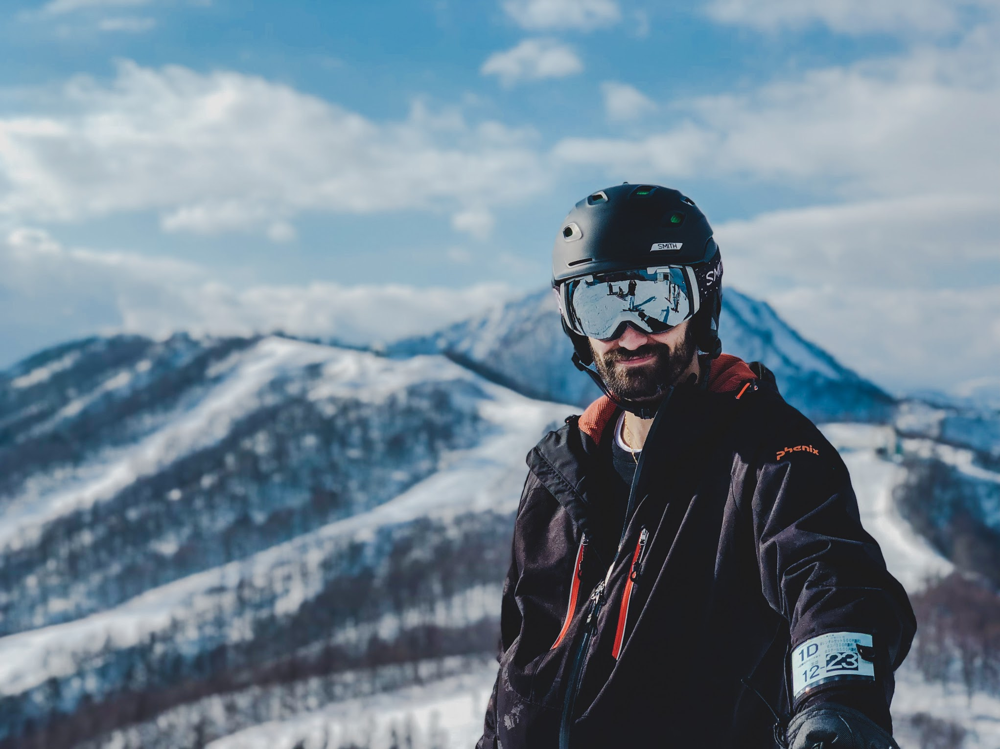

Wow what's this? Some sort of _internet blog_ or something? Well I guess that's exactly what this is. I'm doing it! I'm going to post things if I can ever find the time.

## Who are you and how did I get here?

Well I can only answer one of those questions. I'm Ryan. I'm an engineer. I've been programming since I was about 11 years old. I was always fascinated with the web and wanted to build things for myself. So 11 year old me would sit in the local Barnes and Noble and read every programming book I could get my hands on. Started with Perl and as of this day I am knee deep in Javascript. Mainly focusing on the frontend side of things.

I'm 30 years old (at the time of this article) and happily married with a 3 month old child. Living in Tokyo, Japan and enjoying life like never before!

## I have a lot of hobbies

Maybe too many hobbies. I don't have enough time for all of them. Actually coding itself always was one of my first hobbies. I have always done this for fun and hey what do you know now I'm making money doing it!

I _love_ photography. Especially taking photos of [coffee](https://instagram.com/sctlovescoffee). I used to work from home for many years and I would go out to different coffee shops, work, and take photographs. I haven't been keeping up with the instagram as much lately but photography is still a major part of my life! Here's one of my favorite photos I took of Shibuya, Tokyo.

To name a few other hobbies: I ski like crazy every winter. I scuba dive every chance I can. I ride motorcyles. I also play guitar!

## Why should I listen to you about anything?

Well maybe you shouldn't! I don't know! I've been coding a long time. I have a lot of experience all over the place. Since 2012 I have been maintaining and working on [Technic](https://www.technicpack.net). A minecraft modding/modpack community. We have had our share of mistakes but I have learned so much in my time with Technic. We are still pushing millions of unique visitors a month. How cool is that?

Currently, I am a senior engineer at [U-NEXT](https://video.unext.jp) in Japan. We are a video streaming service. I'm working on the frontend team building and maintaining the React site that is currently live today.

## Other things

My goal with this website is to try and write some tutorials and articles that I wish I had when I had to solve something without any help. Whenever I run into a giant wall and spend weeks fixing it I want to share that story with everyone else. So hopefully the next person can find this website in a google search and I can save them some of the trouble. We'll see how it goes!

If you read all this. You rock. If you just scrolled to the bottom... well... I don't blame you. This is a hell of a lot of words. So:

**tl;dr** I program things. Nice to meet you.